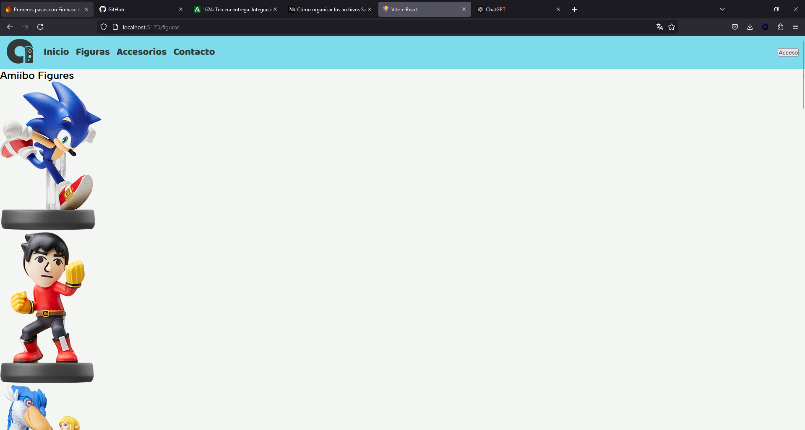
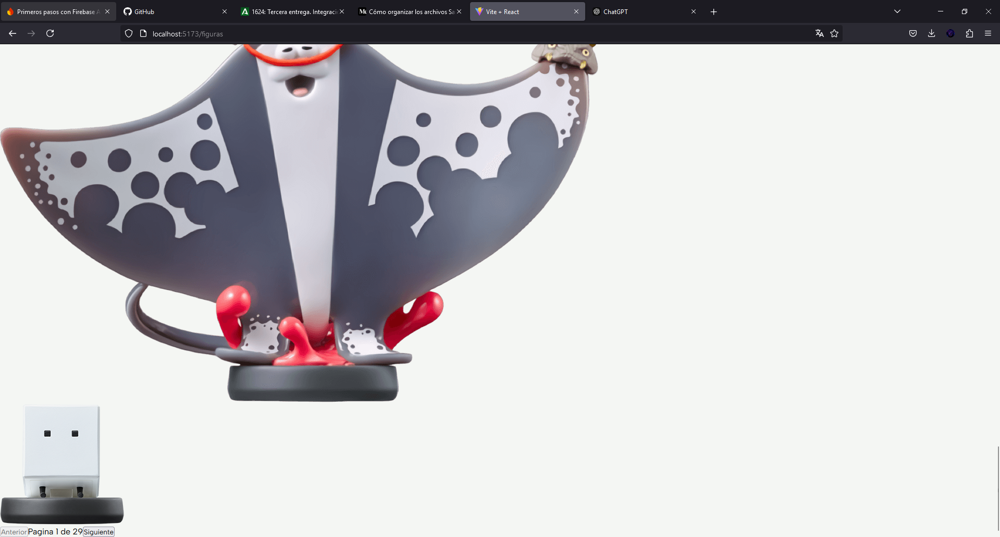
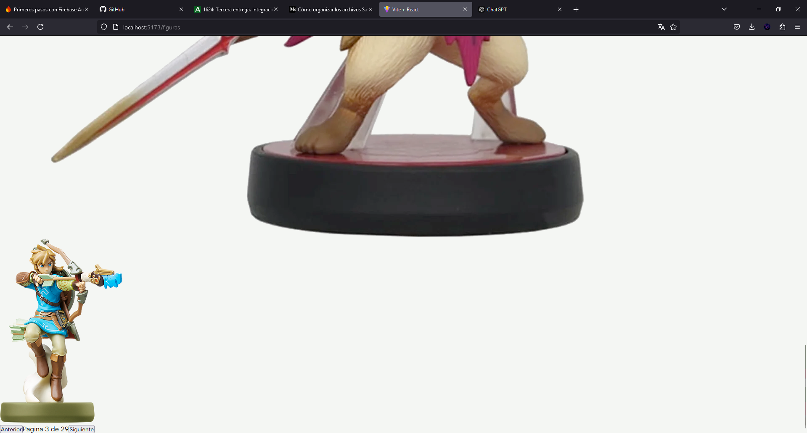

# Proyecto API AMIIBO 
### Desarrollo Web Entorno Cliente: Adrián Ucha Sousa

## Contenido de la Aplicación
Vamos a realizar un proyecto de **diseño, maquetación y desarrollo de una aplicación web** sobre la **AMIIBO API**, 
sobre figuras de Nintendo, y accesorios, en la que tendremos diferentes secciones con información extraída de la API y 
podremos guardar nuestras figuras favoritas en nuestra sección de favoritos, ahora vamos a explicar de una forma más 
detallada las secciones propuesta para dicha aplicación:

- Una página de **inicio básica** en la que podemos ver una descripción sobre la página para hacerla usable y fácil de 
entender a la hora de acceder, en la que tenemos diferentes secciones que nos describen las diferentes secciones,
y podemos acceder desde ella.


- Tenemos una sección donde mostraremos las **figuras de AMIIBO** con una paginación de 8 en 8, y con una serie de filtros
como el tipo de videojuego o serie a la que pertenece, en el que podremos expandir la tarjeta ver mas información y 
agregarla a favoritos(siempre que hayamos iniciado sesión).

- Tenemos otra sección similar pero de cartas y peluches, que serían **Accesorios** para mostrar más contenido y utilización de la API.


- API, para proporcionar algo más de contenido sobre esta, para este
finde estará 100% aclarado debido a que la idea ya esta pensada pero
necesito plantear su diseño.
Está página tendrá 3 filtros para poder buscar por el nombre de
AMIIBO, Su videojuego o a la serie a la que pertenece.


- Y otra similar con accesorios que en este caso son cartas y algunos
peluches que sacaron de AMIIBOS de la serie Yoshi.


- Una página de inicio de sesión y registro que contendrá diferentes
inputs como nombre y apellidos correo contraseña verificar contraseña
y un selector de personaje favorito con lo que personalizamos el fondo
de la página de favoritos en base al personaje seleccionado.


- Una sección de favoritos, en la que podemos ver nuestros favoritos con
sus filtros correspondientes y uno adicional que nos permite filtrar entre
carta, amiibo y peluche.


- Una página de contacto en la que pondremos un sencillo formulario
de envío en el que no tienes porque estar logueado y si lo estas que coja
directamente tu correo electrónico y lo ponga en el input de correo
automáticamente


- Su respectiva página personalizada de error 404 not found.


- Implementación de modo claro oscuro cambiable con un botón que lo
accione desde cualquier página de la web.


## Estructuración del proyecto:

```plaintext
src
├── assets
├── components
│   ├── Navbar.jsx
│   ├── NavbarLogout.jsx
│   ├── NavbarLogged.jsx
├── config
│   ├── Firebase.jsx
├── context
│   ├── userContext.jsx
├── hooks
│   ├── isLoggedHook.jsx
│   ├── validateFormsHook.jsx
├── layout
│   ├── LayoutModal.jsx
│   ├── LayoutPrivate.jsx
│   ├── LayoutRoot.jsx
├── pages
│   ├── Accesories.jsx
│   ├── Contact.jsx
│   ├── Favorites.jsx
│   ├── Accesories.jsx
│   ├── Home.jsx
│   ├── Login.jsx
│   ├── Signup.jsx
├── router
│   ├── router.jsx
├── main.jsx
```

### Assets
Carpeta para las **imágenes y ficheros** de configuración como los estilos en **sass**

### Components
En el [Navbar.jsx](./src/components/Navbar.jsx), renderizamos el navbar logueado, o sin loguear, en base, al estado del 
usuario, con:
- [NavbarLogout.jsx](./src/components/NavbarLogout.jsx)
- [NavbarLogged.jsx](./src/components/NavbarLogged.jsx)

### Config
Encontramos la configuración de Firebase en [Firebase.jsx](./src/config/Firebase.jsx), para manejar el login de los 
usuarios, la idea es implementar también el almacén de favoritos en **IndexedDB**.

### Context
Contexto del Usuario [userContext.jsx](./src/context/userContext.jsx) para cambiar el estado del loguin.

### Hooks Personalizados

Compruba si estás logueado para la redirección a la hora de loguear [isLoggedHook.jsx](./src/hooks/isLoggedHook.jsx)

Para la validación en los formularios reutilizando las variables en los diferentes formularios para una mayor 
refactorización y reutilización del código [validateFormsHook.jsx](./src/hooks/validateFormsHook.jsx)

### Layaouts
Los diferentes layouts para la gestión de las rutas predeterminadas, privadas, y de loguin/registro
- [LayoutModal.jsx](./src/layout/LayoutModal.jsx)
- [LayoutPrivate.jsx](./src/layout/LayoutPrivate.jsx)
- [LayoutRoot.jsx](./src/layout/LayoutRoot.jsx)

### Pages
- [Accesories.jsx](./src/pages/Accesories.jsx) ➡️ Página similar a la de figuras _(No implementada aún)_
- [Contact.jsx](./src/pages/Contact.jsx) ➡️ Página contacto con validación de `formik`
- [Favorites.jsx](./src/pages/Favorites.jsx) ➡️ Donde se almacenaran las figuras, cartas y peluches favoritos.
- [Accesories.jsx](./src/pages/Figures.jsx) ➡️ Página con paginación básica de figuras de la API _(Faltan detalles)_
- [Home.jsx](./src/pages/Home.jsx) ➡️ Pagina inicial _(No implementada)._
- [Login.jsx](./src/pages/Login.jsx) ➡️ Inicio de sesión validado usando `formik`.
- [Signup.jsx](./src/pages/Signup.jsx) ➡️ Registro de la página con validación de formularios usando `formik`.


### Router
Donde renderizamos todas las rutas con **lazyload** y utilizamos los **layouts** [router.jsx](./src/router/router.jsx)

### Renderizado del contenido completo
Donde renderizamos todo el contenido completo de la aplciación [main.jsx](./src/main.jsx)

## Paginación principal de Figuras

Como podemos observar se muestra la obtención de las figuras de **8 en 8**, _todavía sin estilos_ de ahi su mala estructuración
hacemos la llamada **solamente a las figuras**, las almacenamos en un `Array` y ya las vamos mostrando de manera **paginada**,
jugando con el índice del array y unos botones que nos desplazan con `.slice` entre los elementos.


Como se aprecia en estas dos imágenes vemos la implementación de los **botones básicos de paginación**, y que podemos cambiar
de página y se muestran diferentes contenidos.

En resumen se realiza la llamada asíncrona que carga cuando los elementos han cargado, y se va mostrando de manera
página de 8 en 8.