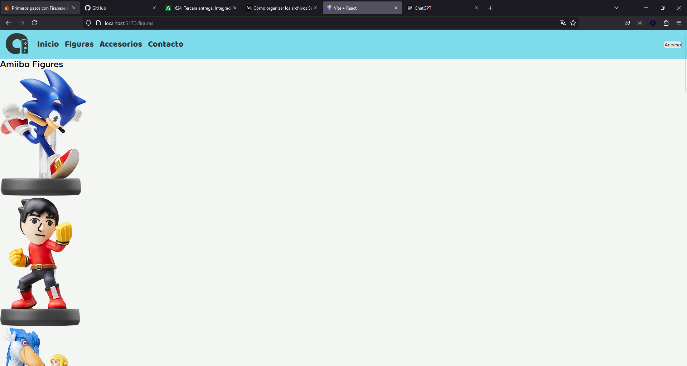
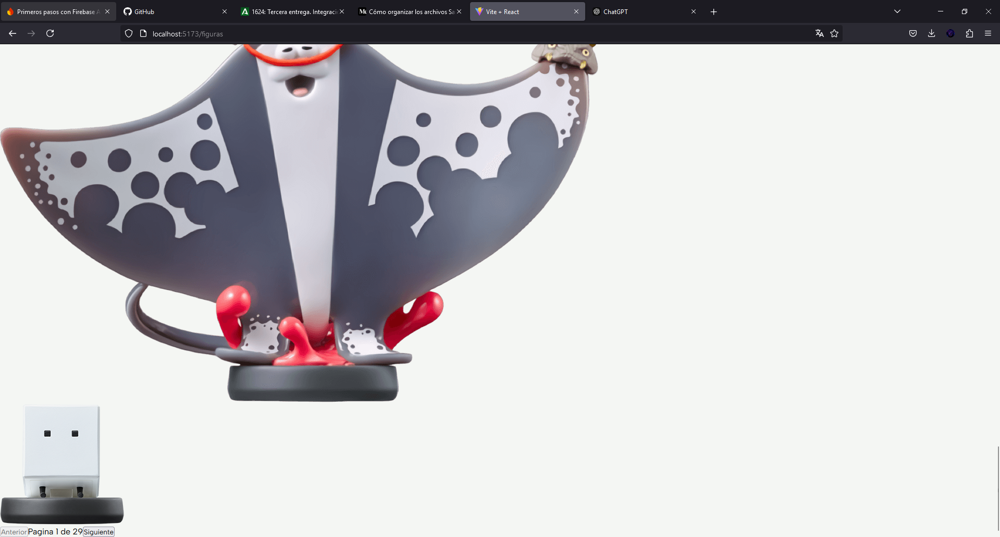
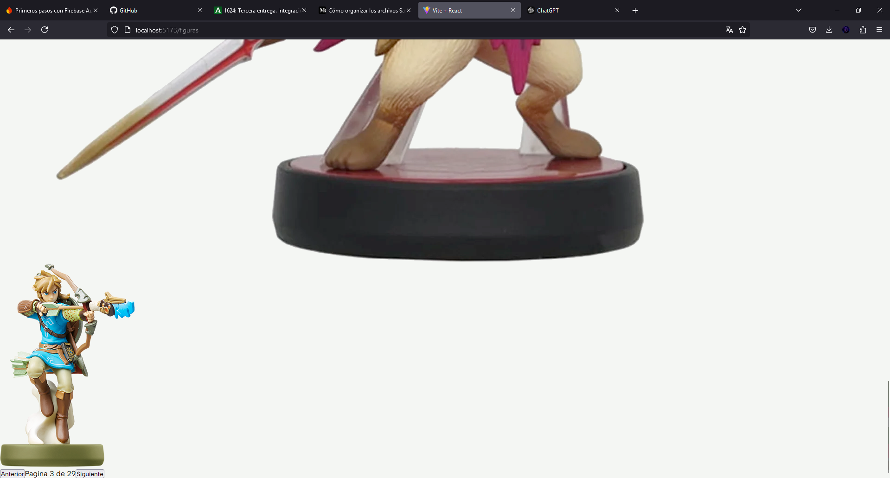
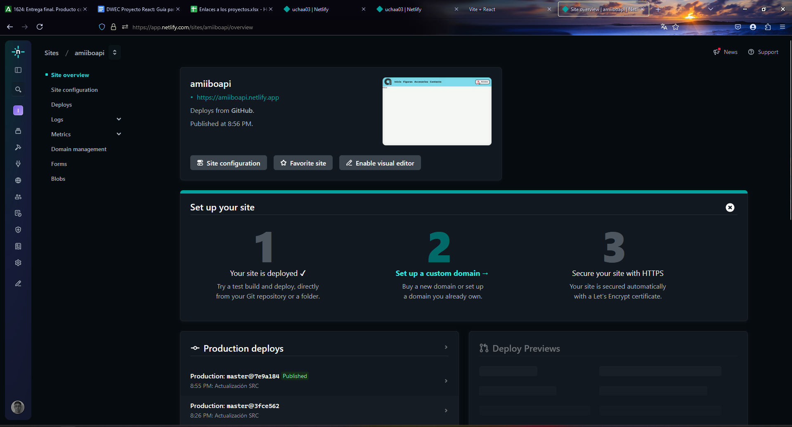

# Proyecto API AMIIBO 
### Desarrollo Web Entorno Cliente: Adrián Ucha Sousa

## Contenido de la Aplicación
Vamos a realizar un proyecto de **diseño, maquetación y desarrollo de una aplicación web** sobre la **AMIIBO API**, 
sobre figuras de Nintendo, y accesorios, en la que tendremos diferentes secciones con información extraída de la API y 
podremos guardar nuestras figuras favoritas en nuestra sección de favoritos, ahora vamos a explicar de una forma más 
detallada las secciones propuesta para dicha aplicación:

- Una página de **inicio básica** en la que podemos ver una descripción sobre la página para hacerla usable y fácil de 
entender a la hora de acceder, en la que tenemos diferentes secciones que nos describen las diferentes secciones,
y podemos acceder desde ella.


- Tenemos una sección donde mostraremos las **figuras de AMIIBO** con una paginación de 8 en 8, y con una serie de filtros
como el tipo de videojuego o serie a la que pertenece, en el que podremos expandir la tarjeta ver más información y 
agregarla a favoritos(siempre que hayamos iniciado sesión).

- Tenemos otra sección similar pero de cartas y peluches, que serían **Accesorios** para mostrar más contenido y utilización de la API.


- API, para proporcionar algo más de contenido sobre esta, para este
finde estará 100% aclarado debido a que la idea ya está pensada, pero
necesito plantear su diseño.
Está página tendrá 3 filtros para poder buscar por el nombre de
AMIIBO, Su videojuego o a la serie a la que pertenece.


- Y otra similar con accesorios que en este caso son cartas y algunos
peluches que sacaron de AMIIBOS de la serie Yoshi.


- Una página de inicio de sesión y registro que contendrá diferentes
inputs como nombre y apellidos correo contraseña verificar contraseña
y un selector de personaje favorito con lo que personalizamos el fondo
de la página de favoritos basándonos en el personaje seleccionado.


- Una sección de favoritos, en la que podemos ver nuestros favoritos con
sus filtros correspondientes y uno adicional que nos permite filtrar entre
carta, amiibo y peluche.


- Una página de contacto en la que pondremos un sencillo formulario
de envío en el que no tienes por qué estar logueado y si lo estás que coja
directamente tu correo electrónico y lo ponga en el input de correo
automáticamente


- Su respectiva página personalizada de error 404 not found.


- Implementación de modo claro oscuro cambiable con un botón que lo
accione desde cualquier página de la web.


## Estructuración del proyecto:

```plaintext
src
├── assets
├── components
│   ├── Cards.jsx
│   ├── Footer.jsx
│   ├── ModalCards.jsx
│   ├── Navbar.jsx
│   ├── NavbarLogout.jsx
│   ├── NavbarLogged.jsx
├── config
│   ├── DexieDB.jsx
│   ├── Firebase.jsx
├── context
│   ├── userContext.jsx
├── hooks
│   ├── addFavoritoHook.jsx (no funcional del todo)
│   ├── isLoggedHook.jsx
│   ├── paginationHook.jsx
│   ├── useUserUid.jsx
│   ├── validateFormsHook.jsx
├── layout
│   ├── LayoutModal.jsx
│   ├── LayoutPrivate.jsx
│   ├── LayoutRoot.jsx
├── pages
│   ├── Accesories.jsx
│   ├── Contact.jsx
│   ├── Favorites.jsx
│   ├── Accesories.jsx
│   ├── Home.jsx
│   ├── Login.jsx
│   ├── Signup.jsx
├── router
│   ├── router.jsx
├── main.jsx
```

### Assets
Carpeta para los **ficheros** de configuración como los estilos en **sass**

### Components
En el [Navbar.jsx](./src/components/Navbar.jsx), renderizamos el navbar logueado, o sin loguear, en base, al estado del 
usuario, con:
- [NavbarLogout.jsx](./src/components/NavbarLogout.jsx)
- [NavbarLogged.jsx](./src/components/NavbarLogged.jsx)

### Config
Encontramos la configuración de Firebase en [Firebase.jsx](./src/config/Firebase.jsx), para manejar el login de los 
usuarios.

Y también encontramos [DexieDB.jsx](./src/config/DexieDB.jsx), que es una librería que facilita mucho la implementación
de **IndexedDB**, gracias a que hace la gestión mucho más corta y fácil de usar, está, ha sido utiliza para el 
almacenamiento de los datos de usuario, y también para el almacenamiento de los favoritos(sin terminar de desarrollar).

### Context
Contexto del Usuario [userContext.jsx](./src/context/userContext.jsx) para cambiar el estado del login.

### Hooks Personalizados
Para la agregación de cartas a la base de datos de favoritos [addFavoriteHook.jsx](./src/hooks/addFavoriteHook.jsx),
a pesar de no estar finalizado la idea era cruzar el uid del usuario actual con él, id de amiibo y uno autoincrementable
para la agregación eliminación y comprobación de si está agregado o no, pero debido a problemas técnicos en el 
desarrollo, no se ha podido implementar dicho hook de forma correcta.

Para la filtración en vivo de elementos hemos creado un hook con el objetivo de utilizarlo en figuras, accesorios y 
favoritos. [filtersHook.jsx](./src/hooks/filtersHook.jsx)

Comprueba si estás logueado para la redirección a la hora de loguear [isLoggedHook.jsx](./src/hooks/isLoggedHook.jsx)

Muy útil para reutilizar los elementos de paginación en las diferentes páginas [paginationHook.jsx](./src/hooks/paginationHook.jsx)

Necesitaba un hook para poder coger los datos de **IndexedDB** del usuario y poder mostrarlos si era necesario y para 
la agregación de elementos a ese usuario en concreto en su página de favoritos, por lo tanto, implemente [useUserUid.jsx](./src/hooks/useUserUid.jsx)

Para la validación en los formularios reutilizando las variables en los diferentes formularios para una mayor 
refactorización y reutilización del código [validateFormsHook.jsx](./src/hooks/validateFormsHook.jsx)

### Layaouts
Los diferentes layouts para la gestión de las rutas predeterminadas, privadas, y de login/registro
- [LayoutModal.jsx](./src/layout/LayoutModal.jsx)
- [LayoutPrivate.jsx](./src/layout/LayoutPrivate.jsx)
- [LayoutRoot.jsx](./src/layout/LayoutRoot.jsx)

### Pages
- [Accesories.jsx](./src/pages/Accesories.jsx) ➡️ Página similar a la de figuras, con un filtro extra de tipo
- [Contact.jsx](./src/pages/Contact.jsx) ➡️ Página contacto con validación de `formik`
- [Favorites.jsx](./src/pages/Favorites.jsx) ➡️ Donde se almacenaran las figuras, cartas y peluches favoritos.
- [Figures.jsx](./src/pages/Figures.jsx) ➡️ Página con paginación básica de figuras de la API, en el que tenemos un 
grid que muestra con la paginación los diferentes elementos, y con un botón con el que accedemos a un modal con el que 
podemos agregar a favoritos elementos _(favoritos en desarrollo)_
- [Home.jsx](./src/pages/Home.jsx) ➡️ Página inicial _(En desarrollo es solo estética no afecta a la funcionalidad de la página)._
- [Login.jsx](./src/pages/Login.jsx) ➡️ Inicio de sesión validado usando `formik`.
- [Signup.jsx](./src/pages/Signup.jsx) ➡️ Registro de la página con validación de formularios usando `formik`.


### Router
Donde renderizamos todas las rutas con **lazyload** y utilizamos los **layouts** [router.jsx](./src/router/router.jsx)

### Renderizado del contenido completo
Donde renderizamos todo el contenido completo de la aplicación [main.jsx](./src/main.jsx)

## Paginación principal de Figuras

Como podemos observar se muestra la obtención de las figuras de **8 en 8**, _todavía sin estilos_ de ahi su mala estructuración
hacemos la llamada **solamente a las figuras**, las almacenamos en un `Array` y ya las vamos mostrando de manera **paginada**,
jugando con el índice del array y unos botones que nos desplazan con `.slice` entre los elementos.


Como se aprecia en estas dos imágenes vemos la implementación de los **botones básicos de paginación**, y que podemos cambiar
de página y se muestran diferentes contenidos.

En resumen se realiza la llamada asíncrona que carga cuando los elementos han cargado, y se va mostrando de manera
página de 8 en 8.

## Despliegue de la aplicación 
Yo para desplegar mi aplicación y que funcione correctamente he utilizado **[Netlify](https://www.netlify.com/)**.

En el que enlace este repo de github y despliegue desde el terminal de Netlify, así podemos actualizar el repo y el 
despliegue se actualiza automáticamente.

Importante también configurar desde la app las variables de entorno para que funcionen, como me hacía falta a mí 
en este caso para **Firebase**


### [Video Explicativo del Proyecto](https://youtube.com/watch?v=vtm5HJ3STD8&feature=shared)

## Conclusión
El proyecto es un proyecto muy divertido y también complejo, por una parte, estoy satisfecho debido a que a nivel de 
comprensión he mejorado muchísimo, pero, por otra parte, no pude finalizar el proyecto al 100% ni en estilos, ni en 
la funcionalidad de favoritos a pesar de que mi planteamiento no sea mala idea.

Falto implementar la página inicial, que es para mejorar la usabilidad comprensión de la página.
También la de favoritos, y la funcionalidad de agregar y eliminar para que funcionara correctamente.
Y el diseño para una mejor visualización del producto que deja mucho que desear.

Por lo tanto, he tenido una muy mala gestión al final de proyecto que ha provocado que no cumpla los objetivos que 
pretendía cumplir, toca trabajar más organizarse mejor y seguir mejorando.